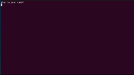

<!-- PROJECT LOGO -->
 

  

  <h3 align="center">Bulls and Cows</h3>

  

    Try this awesome game!
     
    <a href="https://github.com/anyuka007/Bull-and-Cows"><strong>Explore the docs »</strong></a>
     
     
    <a href="#demo">View Demo</a>
    ·
    <a href="https://github.com/anyuka007/Bull-and-Cows/issues/new?labels=bug&template=bug-report---.md">Report Bug</a>
    ·
    <a href="https://github.com/anyuka007/Bull-and-Cows/issues/new?labels=enhancement&template=feature-request---.md">Request Feature</a>
  

<!-- TABLE OF CONTENTS -->

  
Table of Contents

  <ol>
    <li>
      <a href="#about-the-project">About The Project</a>
      <ul>
        <li><a href="#built-with">Built With</a></li>
      </ul>
    </li>
    <li><a href="#contact">Contact</a></li>
    <li><a href="#acknowledgments">Acknowledgments</a></li>
  </ol>

<!-- ABOUT THE PROJECT -->
## About The Project

  <a href="https://github.com/anyuka007/Bull-and-Cows">
    <!--  -->
     <video width="320" height="240" controls>
  <source src="gameVideo.mp4" type="video/mp4">
Your browser does not support the video tag.
</video>
  </a>

Welcome to Bulls and Cows, the ultimate game of logic and deduction! Whether you're pitting your wits against a friend or challenging the computer, this game will keep you on your toes. 

Game Modes:

Player vs. Computer:
You Guess: The computer selects a secret four-digit number, with all digits unique. Your task is to guess the computer's number as efficiently as possible.
Computer's Clues: After each guess, the computer will give you feedback:
Bulls: Digits that are correct and in the right position.
Cows: Digits that are correct but in the wrong position.
Keep guessing until you correctly decipher the computer's secret number. Can you beat the machine?

Computer vs. Player:
Computer Guesses: This time, you set a secret four-digit number with unique digits. The computer will try to guess your number.
Your Clues: After each guess by the computer, you’ll need to provide feedback:
Bulls: Digits that are correct and in the right position.
Cows: Digits that are correct but in the wrong position.
Watch as the computer tries to crack your code. How many guesses will it take?

Example of Play:
Secret Number: 4271
Guess: 1234
Result: 1 Bull (the digit "2" is correct and in the right spot) and 2 Cows (the digits "4" and "1" are correct but in the wrong spots).

Winning:
In Player vs. Computer, you win by correctly guessing the computer's secret number.
In Computer vs. Player, you win if the computer can't guess your secret number in a reasonable number of tries!
Are you ready to take on the challenge? Select your mode and start cracking codes!

(<a href="#readme-top">back to top</a>)

### Built With

This section should list any major frameworks/libraries used to bootstrap your project. Leave any add-ons/plugins for the acknowledgements section. Here are a few examples.

* [![JavaScript][JS.js]][JS-url]
* [![Chalk][Chalk.js]][Chalk-url]
* [![Readline-sync][ReadlineSync.js]][ReadlineSync-url]
* [![ChalkAnimation][ChalkAnimation.js]][ChalkAnimation-url]

(<a href="#readme-top">back to top</a>)

<!-- CONTACT -->
## Contact

Anna Popova - anna.popova.de@gmail.com

Project Link: (https://github.com/anyuka007/Bull-and-Cows)

(<a href="#readme-top">back to top</a>)

<!-- ACKNOWLEDGMENTS -->
## Acknowledgments

Here are some of the resources I find particularly helpful and would like to give credit to. 

* [npm chalk](https://www.npmjs.com/package/chalk)
* [npm readline-sync](https://www.npmjs.com/package/readline-sync)
* [npm chalk animation](https://www.npmjs.com/package/chalk-animation)

(<a href="#readme-top">back to top</a>)

<!-- MARKDOWN LINKS & IMAGES -->
<!-- https://www.markdownguide.org/basic-syntax/#reference-style-links -->

[JS.js]: https://shields.io/badge/JavaScript-F7DF1E?logo=JavaScript&logoColor=000&style=flat-square
[JS-url]: https://www.javascript.com/
[Chalk.js]: https://img.shields.io/badge/chalk-npm-red
[Chalk-url]: https://www.npmjs.com/package/chalk/v/0.5.1
[ReadlineSync.js]: https://img.shields.io/badge/readline_sync-npm-red
[ReadlineSync-url]: https://www.npmjs.com/package/readline-sync
[ChalkAnimation.js]: https://img.shields.io/badge/chalk_animation-npm-red
[ChalkAnimation-url]: https://www.npmjs.com/package/chalk-animation

